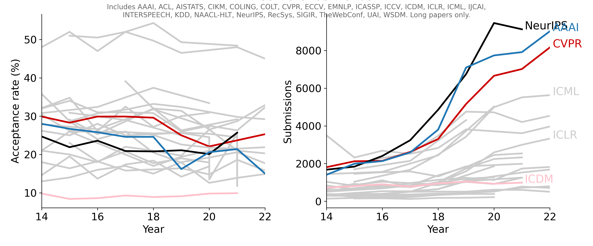

Acceptance rates for the ~~major~~ top-tier AI-related conferences
===== 

### Natural Language Processing and Computational Linguistics

| Conference        | Long Paper           | Short Paper  |
| ------------- | :------------- | :----- |
|ACL'14 | 26.2% (146/572) | 26.1% (139/551) |
|ACL'15 | 25.0% (173/692) | 22.4% (145/648) |
|ACL'16 | 28.0% (231/825) | 21.0% (97/463) |
|ACL'17 | 25.0% (195/751) | 18.9% (107/567) |
|ACL'18 | 25.3% (258/1018) | 24.0% (126/526) |
|ACL'19 | 25.7% (447/1737) | 18.2% (213/1168) |
|ACL'20 | 25.4% (571/2244) | 17.6% (208/1185) |
|ACL'21 | 24.5% (571/2327) | 13.6% (139/1023) |
|ACL'21 Findings | 14.6% (339/2327) | 11.5% (118/1023) |
|ACL'22 | ? (604/?) | ? (97/?) |
|ACL'22 Findings | ? (361/?) | ? (361/?) |
|ACL'23 | 23.5% (910/3872) | 16.5% (164/992) |
|ACL'23 Findings | 18.4% (712/3872) | 19.1% (189/992) |
|EMNLP'14 | 30.4% (155/510) | 27.8% (70/252) |
|EMNLP'15 | 26.2% (157/600) | 22.1% (155/700) |
|EMNLP'16 | 25.8% (177/687) | 21.8% (87/400) |
|EMNLP'17 | 25.8% (216/836) | 18.4% (107/582) |
|EMNLP'18 | 25.5% (351/1376) | 23.2% (198/855) |
|EMNLP'19 | 25.6% (465/1813) | 20.5% (218/1063) |
|EMNLP'20 | 24.5% (602/2455) | 16.6% (150/904) |
|EMNLP'20 Findings | 13.5% (332/2455) | 12.7% (115/904) |
|EMNLP'21 | 25.6% (650/2540)| 17.9% (190/1060)|
|EMNLP'21 Findings | 11.8% (300/2540) | 11.2% (119/1060)|
|EMNLP'22 | 22.1% (715/3242)| 12.0% (114/948)|
|EMNLP'22 Findings | 14.0% (453/3242) | 10.1% (96/948)|
|NAACL-HLT'13 | 30.0% (88/293) | 32.1% (51/162) |
|NAACL-HLT'15 | 29.1% (117/402) | 22.1% (69/312) |
|NAACL-HLT'16 | 25.3% (100/396) | 28.9% (82/284) |
|NAACL-HLT'18 | 32.0% (207/647) | 29.4% (125/425) |
|NAACL-HLT'19 | 26.3% (281/1067) | 21.3% (142/666) |
|NAACL-HLT'21 | 29.2% (366/1254) | 22.6% (123/544) |
|NAACL-HLT'22 | ? (358/?) | ? (84/?) |
|NAACL-HLT'22 Findings | ? (183/?) | ? (26/?) |
|COLING'12 | 27% (311/1000+) | - |
|COLING'14 | 30.8% (217/705) | - |
|COLING'16 | 32.4% (337/1039) | - |
|COLING'18 | 37.4% (332/888) | - |
|COLING'20| 33.4% (622/1862) | - |
|COLING'22| 33.4% (522/1563) | 24.2% (112/463) |  

### Computer Vision and Pattern Recognition

| Conference        | Long Paper           | Short Paper  |
| ------------- |:-------------|:-----|
|CVPR'14 | 29.9% (540/1807) (104 orals and 436 posters) | - |
|CVPR'15 | 28.3% (602/2123) (71 orals and 531 posters) | - |
|CVPR'16 | 29.9% (643/2145) (83 orals, 123 spotlights and 437 posters) | - |
|CVPR'17 | 29.9% (783/2620) (71 orals, 144 spotlights and 568 posters) | - |
|CVPR'18 | 29.6% (979/3303) (70 orals, 224 spotlights and 685 posters) | - |
|CVPR'19 | 25.0% (1294/5160) (288 short orals and 1294 posters)| - |
|CVPR'20 | 22.1% (1470/6656) | - |
|CVPR'21 | 23.7% (1661/7015) (295 orals and 1366 posters) | - |
|CVPR'22 | 25.3% (2067/8161) | - |
|CVPR'23 | 25.8% (2360/9155) | - |
|ICCV'13 | 27.9% (454/1629) (41 orals and 413 posters) | - |
|ICCV'15 | 30.9% (525/1698) | - |
|ICCV'17 | 29.0% (621/2143) (45 orals, 56 spotlights and 520 posters) | - |
|ICCV'19 | 25.0% (1077/4304) (187 short orals and 1077 posters)| - |
|ECCV'14 | 27.9% (363/1444) (38 orals and 325 posters) | - |
|ECCV'16 | 26.6% (415/1561) (28 orals, 45 spotlights and 342 posters) | - |
|ECCV'18 | 31.8% (776/2439) (59 orals and 717 posters) | - |
|ECCV'20 | 27.1% (1361/5025) (104 orals, 161 spotlights and 1096 posters) | - |

### Machine Learning and Learning Theory

| Conference        | Long Paper           | Short Paper  |
| ------------- |:-------------|:-----|
|ICML'14 | 15.0% (Cycle I), 22.0% (Cycle II) | - |
|ICML'15 | 26.0% (270/1037) | - |
|ICML'16 | 24.0% (322/?) | - |
|ICML'17 | 25.9% (434/1676) | - |
|ICML'18 | 25.1% (621/2473) | - |
|ICML'19 | 22.6% (773/3424) | - |
|ICML'20 | 21.8% (1088/4990) | - |
|ICML'21 | 21.5% (1184/5513) (166 long talks, 1018 short talks) | - |
|ICML'22 | 21.9% (1235/5630) (118 long talks, 1117 short talks) | - |
|ICML'23 | 27.9% (1827/6538) (158 live orals, 1669 virtual orals with posters) | - |
|NeurIPS'14 | 24.7% (414/1678) | - |
|NeurIPS'15 | 21.9% (403/1838) | - |
|NeurIPS'16 | 23.6% (569/2403) | - |
|NeurIPS'17 | 20.9% (678/3240) (40 orals, 112 spotlights and 526 posters) | - |
|NeurIPS'18 | 20.8% (1011/4856) (30 orals, 168 spotlights and 813 posters) | - |
|NeurIPS'19| 21.1% (1428/6743) (36 orals, 164 spotlights and 1228 posters) | - |
|NeurIPS'20| 20.1% (1900/9454) (105 orals, 280 spotlights and 1515 posters) | - |
|NeurIPS'21| 25.7% (2344/9122) (55 orals, 260 spotlights and 2029 posters) | - |
|NeurIPS'22| 25.6% (?/10411) (? orals, ? spotlights and ? posters) | - |
|NeurIPS'23| 26.1% (3218/12343) (67 orals, 378 spotlights and 2773 posters) | - |
|ICLR'14 | - | - |
|ICLR'15 | - | - |
|ICLR'16 | - | - |
|ICLR'17 | 39.1% (198/507) (15 orals and 183 posters) | - |
|ICLR'18 | 32.0% (314/981) (23 orals and 291 posters) | - |
|ICLR'19| 31.4% (500/1591) (24 orals and 476 posters) | - |
|ICLR'20| 26.5% (687/2594) (48 orals, 107 spotlights and 532 posters) | - |
|ICLR'21| 28.7% (860/2997) (53 orals, 114 spotlights and 693 posters) | - |
|ICLR'22| 32.9% (1095/3328) (54 orals, 176 spotlights and 865 posters) | - |
|ICLR'23| 32.0% (1574/4956) (91 orals, 280 spotlights and 1203 posters) | - |
|ICLR'24| 30.81% (2250/7304) (85 orals, 366 spotlights and 1799 posters) | - |
|COLT'14 | 32.1% (45/140) | - |
|COLT'15 | 34.8% (62/178) | - |
|COLT'16 | 26.1% (53/203) | - |
|COLT'17 | 32.5% (74/228) | - |
|COLT'18 | 27.2% (91/335) | - |
|COLT'19 | 30.0% (118/393) | - |
|COLT'20| 30.9% (120/388) | - |
|UAI'14 | 32.0% (94/292) | - |
|UAI'15 | 34.0% (99/291) | - |
|UAI'16 | 31.0% (85/275) | - |
|UAI'17 | 31.0% (87/282) | - |
|UAI'18 | 30.8% (104/337) | - |
|UAI'19 | 26.0%  (118/450) | - |
|UAI'20 | 27.5%  (142/515) | - |
|UAI'21 | 26.3%  (205/777) | - |
|UAI'22 | 32.3%  (230/712) (36 orals and 194 posters) | - |
|UAI'23 | 31.2%  (243/778) | - |
|AISTATS'14 | 35.8% (120/335) | - |
|AISTATS'15 | 28.7% (127/442) | - |
|AISTATS'16 | 30.7% (165/537) | - |
|AISTATS'17 | 31.7% (168/530) | - |
|AISTATS'18| 33.2% (214/645) | - |
|AISTATS'19| 32.4% (360/1111) | - |
|AISTATS'20| - | - |
|AISTATS'21| 29.8% (455/1527) (48 orals)  | - |
|AISTATS'22| 29.2% (493/1685) | - |
|AISTATS'23| - | - |
|AISTATS'24| 27.6% (546/1980) | - |

### Artificial Intelligence

| Conference        | Long Paper           | Short Paper  |
| ------------- |:-------------|:-----|
|AAAI'14 | 28.0% (398/1406) | - |
|AAAI'15 | 26.7% (531/1991) | - |
|AAAI'16 | 25.8% (549/2132) | - |
|AAAI'17 | 24.6% (638/2590) | - |
|AAAI'18 | 24.6% (933/3800) | - |
|AAAI'19 | 16.2% (1150/7095) | - |
|AAAI'20 | 20.6% (1591/7737) | - |
|AAAI'21 | 21.4% (1692/7911) | - |
|AAAI'22 | 15.0% (1349/9020) | - |
|AAAI'23 | 19.6% (1721/8777) | - |
|AAAI'24 | 23.75% (2342/9862) | - |
|IJCAI'13 | 28.0% (413/1473) | - |
|IJCAI'15 | 28.6% (572/1996) | - |
|IJCAI'16 | 24.0% (551/2294) | - |
|IJCAI'17 | 26.0% (660/2540) | - |
|IJCAI'18 | 20.5% (710/3470) | - |
|IJCAI'19 | 17.9% (850/4752) | - |
|IJCAI'20 | 12.6% (592/4717) | - |
|IJCAI'21 | 13.9% (587/4204) | - |
|IJCAI'22 | 14.9% (679/4535) | - |

### Data Mining and Information Retrieval

| Conference        | Long Paper           | Short Paper  |
| ------------- |:-------------|:-----|
|KDD'14 | 14.6% (151/1036) | - |
|KDD'15 | 19.5% (160/819) | - |
|KDD'16 | 13.7% (142/1115) | - |
|KDD'17 | 17.4% (130/748) | - |
|KDD'18 | 18.4% (181/983) (107 orals and 74 posters) | - |
|KDD'19 | 14.2% (170/1200) (110 orals and 60 posters) | - |
|KDD'20 | 16.9% (216/1279) | - |
|KDD'22 | 15.0% (254/1695) | - |
|KDD'23 | 22.1% (313/1416) | - |
|SIGIR'14 | 21.0% (82/387) | 40.0% (104/263) |
|SIGIR'15 | 20.0% (70/351) | 31.3% (79/252) |
|SIGIR'16 | 18.0% (62/341) | 30.6% (104/339) |
|SIGIR'17 | 22.0% (78/362) | 30.0% (121/398) |
|SIGIR'18 | 21.0% (86/409) | 30.0% (98/327) |
|SIGIR'19 | 19.7% (84/426) | 24.4% (108/443) |
|SIGIR'20 | 26.5% (147/555) | 30.2% (153/507) |
|SIGIR'21 | 21.0% (151/720) | 27.6% (145/526) |
|SIGIR'22 | 20.3% (161/794) | 24.7% (165/667) |
|TheWebConf'14 | 13.0% (84/645) | - |
|TheWebConf'15 | 14.0% (131/929) | - |
|TheWebConf'16 | 16.0% (115/727) | - |
|TheWebConf'17 | 17.0% (164/966) | - |
|TheWebConf'18 | 15.0% (171/1140) | - |
|TheWebConf'19 | 18.0% (225/1247) | 19.9% (72/361) |
|TheWebConf'20 | 19.2% (217/1129) | 24.7% (98/397) |
|TheWebConf'21 | 20.6% (357/1736) | - |
|TheWebConf'22 | 17.7% (323/1822) | - |
|TheWebConf'23 | 19.2% (365/1900) | - |
|WSDM'14 | 18.0% (64/355) | - |
|WSDM'15 | 16.4% (39/238) | - |
|WSDM'16 | 18.2% (67/368) | - |
|WSDM'17 | 15.8% (80/505) | - |
|WSDM'18 | 16.1% (84/514) | - |
|WSDM'19 | 16.4% (84/511) | - |
|WSDM'20 | 14.8% (91/615) | - |
|WSDM'21 | 18.6% (112/603) | - |
|WSDM'22 | 15.8% (80/505) | - |
|WSDM'23 | 17.8% (123/690) | - |
|CIKM'14 | 21.0% (175/838) | 21.9% (57/260) |
|CIKM'15 | 26.0% (165/646) | 25.0% (69/276) |
|CIKM'16 | 23.0% (160/701) | 23.5% (55/234) |
|CIKM'17 | 20.0% (171/855) | 28.4% (119/419) |
|CIKM'18| 17.0% (147/862) | 23.2% (96/413) |
|CIKM'19 | 19.4% (200/1030) | 21.3% (100/470) |
|CIKM'20 | 21.0% (193/920) | 25.9% (103/397) |
|CIKM'21 | 21.7% (271/1251) | 28.3% (177/626) |
|CIKM'22 | ?% (272/?) | ?% (196/?) |
|ICDM'14 | 9.8% (71/727) | 9.8% (71/727) |
|ICDM'15 | 8.4% (68/807) | 9.7% (78/807) |
|ICDM'16 | 8.6% (78/904) | 11.0% (100/904) |
|ICDM'17 | 9.3% (72/778) | 10.7% (83/778) |
|ICDM'18 | 8.9% (84/948) | 11.1% (105/948) |
|ICDM'19 | 9.1% (95/1046) | 9.5% (99/1046) |
|ICDM'20 | 9.8% (91/930) | 9.9% (92/930) |
|ICDM'21 | 9.9% (98/990) | 10.1% (100/990) |
|RecSys'15| 23.0% (35/152) | - |
|RecSys'16| 18.2% (29/159) | - |
|RecSys'17| 20.8% (26/125) | 16.4% (20/122) |
|RecSys'18| 17.7% (32/181) | - |
|RecSys'19| 19.0% (36/189) | - |
|RecSys'20| 17.9% (39/218) | - |

### Speech and Signal Processing

| Conference        | Long Paper           | Short Paper  |
| ------------- |:-------------|:-----|
|INTERSPEECH'14| - | - |
|INTERSPEECH'15| 51.0% (~743/1458) | - |
|INTERSPEECH'16| 50.5% (779/1541) | - |
|INTERSPEECH'17| 52.0% (799/1582) | - |
|INTERSPEECH'18| 54.3% (749/1320) | - |
|INTERSPEECH'19| 49.3% (914/1855) | - |
|INTERSPEECH'20| ~47% (?/?) | - |
|INTERSPEECH'21| 48.4% (963/1990) | - |
|ICASSP'14| 48.0% (1709/3500) | - |
|ICASSP'15| 52.0% (1207/2322) | - |
|ICASSP'16| 47.0% (1265/2682) | - |
|ICASSP'17| 52.0% (1220/2518) | - |
|ICASSP'18| 49.7% (1406/2829) | - |
|ICASSP'19| 46.5% (1774/3815) | - |
|ICASSP'21| 48.0% (1734/3610) | - |
|ICASSP'22| 45.0% (1785/3967) | - |
|ICASSP'23| ?% (? /?) | - |
|ICASSP'24| 45.0% (~2812/5796) | - |

Note: 

1. For **KDD** and **TheWebConf** (formerly known as **WWW**), only the papers from research track are counted.  
2. For **ICDM**, submissions of short paper and those of long paper are in the same session and the decision of the paper type is made according to its quality.
